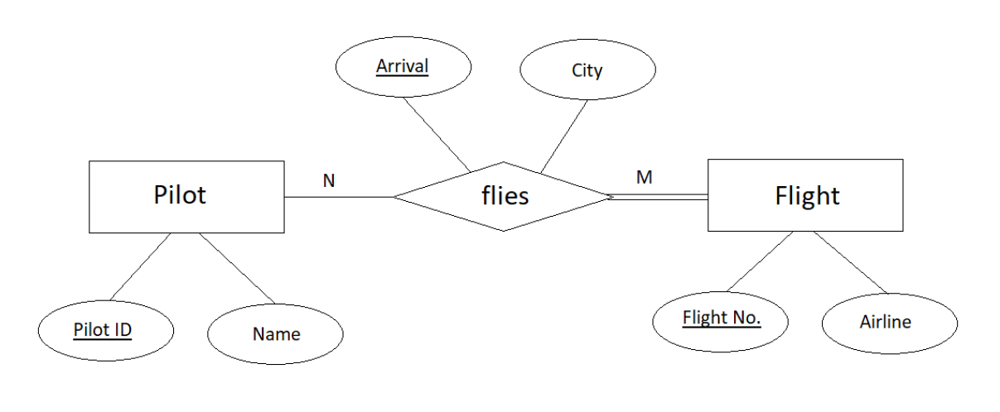
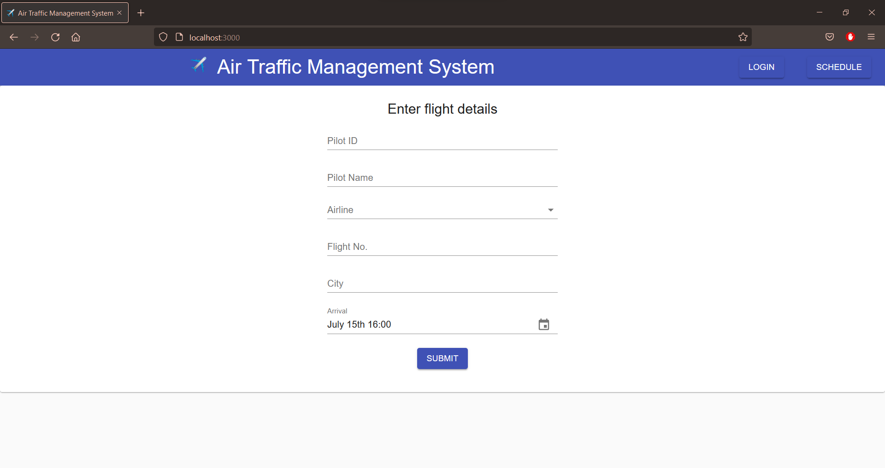
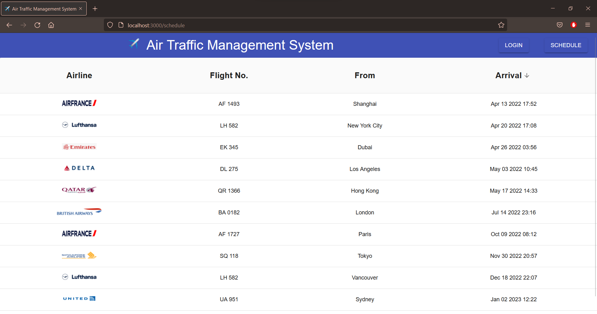

# Air Traffic Management System

The goal is to create a system that will monitor the arrival of flights and make sure that there is sufficient time between two arrivals. Thus, we design the database such that there are two entities, ‘Pilot’ and ‘Flight’. They are connected by the relationship ‘flies’, i.e., Pilot flies Flight. Pilot entity has two attributes, an 8-digit integer ID which uniquely identifies a pilot, and name. Flight entity has two attributes, a code which uniquely identifies a flight, and the airline it belongs to. The relationship flies also has two attributes. A pilot flying a flight must arrive at a particular datetime, which is unique according to the constraints given in the problem, and must arrive from a particular city. The relationship is N:M (many-to-many). A pilot may fly multiple flights on different datetimes. Similarly, one flight may be flown by multiple pilots on different datetimes. Also, there is total participation on flight but partial participation on pilot, therefore each flight must be flown by at least one pilot but a pilot may not fly any flights.

## ER diagram

## Functional Dependencies

Pilot ID → Pilot Name

Flight No. → Airline

Arrival datetime → Pilot ID, Flight No., City

## Schema Design

We see that there are transitive dependencies in 1NF. Thus, to remove them and create a 3NF database, 3 tables are created for the schema –

pilot (pilot_id, pilot_name) where PK = pilot_id

flight (flight_no, airline) where PK = flight_no

arrival (date_time, from_city, pilot_id, flight_no) where PK = date_time and FK = pilot_id, flight_no

## Other constraints

A flight must not arrive within 5 minutes of another, so a trigger is created before insert on ‘arrival’ table which rejects them.Also, to ensure that ‘pilot’ and ‘flight’ tables are not updated in such a case, insert operations of all 3 tables are put inside a transaction, so that it either executes entirely, or not at all.

## Web UI

